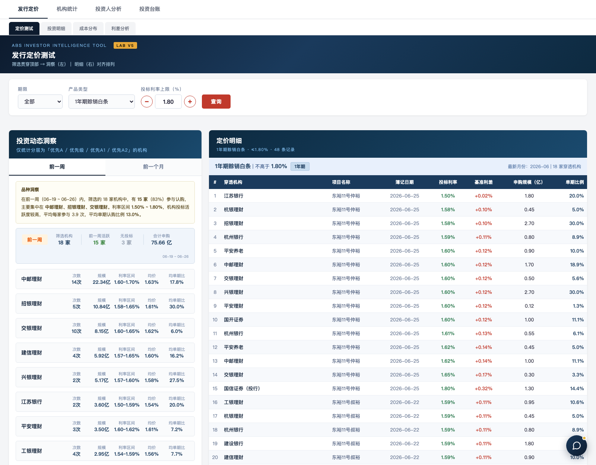
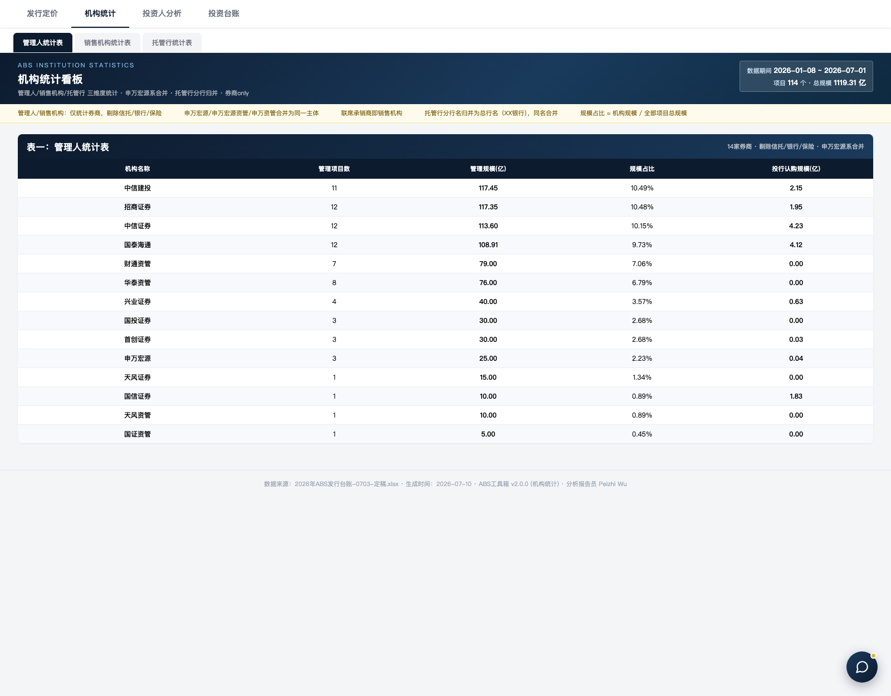
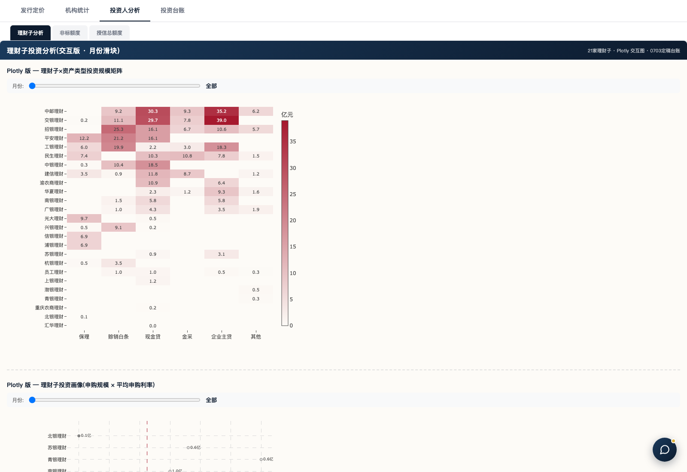
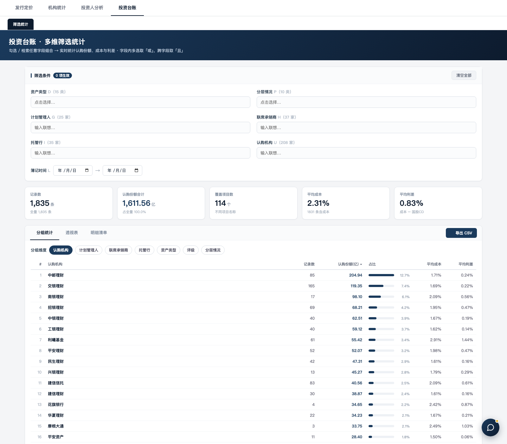
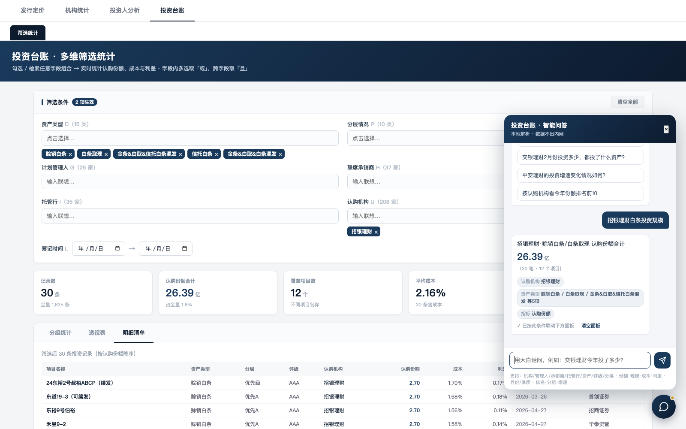

# ABS工具箱 · AI Agent Skill 参赛演示

> 对 Agent 说一句大白话，5 分钟跑完 ABS 发行业务全流程：明细录入 → 台账加工 → 六大分析看板 → 自然语言问数。纯本地、零依赖、数据不出内网。

---

## 一、项目介绍

ABS工具箱是面向资产支持证券（ABS）发行业务的 AI Agent Skill，整合簿记录入、机构统计、发行定价三个原独立 Skill。业务同事说一句大白话——"补充簿记数据""跑个综合看板"——即自动完成从簿记明细录入、台账加工到四大模块共 11 个面板的综合看板生成，并可用自然语言直接问数。纯本地运行、数据不出内网，产出为零依赖单文件 HTML，转发即用。历经六轮版本迭代、38 项踩坑内化，由 AI Agent 多会话协作开发。

---

## 二、项目亮点

**1. 自然语言即界面，查数 3 秒响应。** 无需命令与菜单："跑综合看板"一键出 11 个面板；内置问答助手，问"招银理财白条投资规模"3 秒返回 26.39 亿——本地语义解析自动展开子串（"白条"→5 类资产）、归一业务同义词（"夹层"→中间级），先亮出"我理解的条件"再给数字，答案实时联动面板筛选器，支持追问。

**2. 端到端无人值守，告别手工马拉松。** 从明细 Excel 丢入目录到六大看板产出全链路自动：1835 条投资记录、114 个项目、16 类产品约 5 分钟跑完；243 个原始机构名经多级匹配（精确→去连字符→核心名→硬映射）自动归并至 213 个，消除人工 VLOOKUP 必漏的异名变体。

**3. 确定性、可审计、零边际成本。** 纯本地 Python 管线（pandas+openpyxl），智能问答为确定性解析而非 LLM，结果可复现可审计；零 API 费用，数据全程不出内网；1.3MB 单文件 HTML 零部署零运维。

**4. 工程化治理完备。** 每轮全流程执行 60+ 项 QC 校验；5 层自检回归体系（字节对比→端到端→逐 cell diff→原 skill 冒烟→回归测试）保证零回归；A→B→C 三角色审计循环（实现→独立审计→归档）全程留痕；双远程同步与多 Agent 协作版本管理规范支撑并行开发不冲突。

---

## 三、功能演示

**发行定价 · 定价测试**：选品种与利率上限，左侧自动生成投资动态洞察（活跃机构、利率区间、认购比例），右侧逐笔定价明细对齐排列。

**机构统计**：管理人/销售机构/托管行三维排名，自动券商过滤与集团实体合并（申万宏源系、托管行分行归总行）。

**投资人分析**：理财子投资矩阵与画像（Plotly 交互+月份滑块）、非标额度与授信总额度监控（摊还到期+新增认购→实时剩余额度）。

**投资台账**：1835 条投资记录六维任意组合筛选（资产/分层/评级/机构/时间/份额区间），分组统计、透视表、明细清单三视图，一键导出 CSV。

**智能问答**：大白话问数，条件回显可核对，答案联动面板。

---

## 四、价值论证与价值贡献

**降本增效。** 周频人工流程：簿记明细逐行核对录入 1–2 小时、机构统计透视归并 1–1.5 小时、定价三看板取数制表 1–2 小时，单次合计 3–5.5 小时；工具压缩至 5 分钟，时间成本降低约 98%。按每周一轮估算，全年节省 150–280 人时（约 1–1.8 人月）；推广至 3–5 名同事，年节省可达 3–9 人月。智能问答再把"提需求→等分析员→拿数字"的天级链路变为秒级自助，按每日 5 次口径查询、每次免去 15 分钟人工取数估算，另省约 30 人日/年。

**提质控险。** 人工操作三类高频差错——机构名漏配、簿记年份/格式错录、向下填充数据污染——通过 38 项踩坑规则内化与每轮 60+ 项 QC 全量校验实现系统性拦截：实测已自动纠正簿记年份错录、自动归并 30 个机构异名变体、拦截分层口径与负利差异常，消除下游决策的数据偏差隐患。

**零边际成本与可复制性。** 无 API 调用费用、无服务器运维成本，合规零风险；`compute_data + render_body` 双接口架构与"lab 实验转正"孵化机制可直接平移至任何 Excel 台账类业务场景，一套方法论多处复用。
